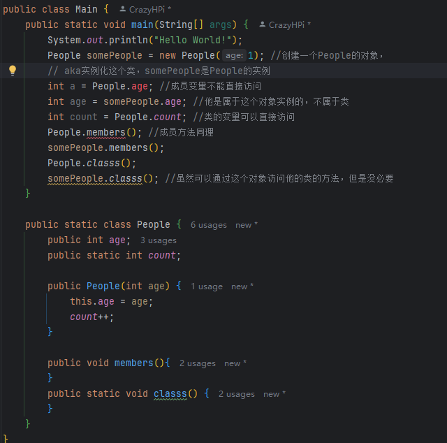

## 对象

### 基本概念

在java中所有创建的都是`对象`，所有对`对象`的操作都是通过`引用`来实现的

一个具体的例子

```java
{
String S = new String("testString);
}
```

`String S`只是创建了一个引用，其中`new`关键字是一个操作符，即对这个为这个引用获得新的对象

### 基本类型

java通过`new`操作符并非直接创建所需要的变量，而是一个“自动“变量直接储存值，且大小是不随硬件改变的

```java
{
char c = 'test';
Character ch = new Character (c);
}

{
Character ch = new Character ('test');
}
```

上述代码就是如何使用包装器类型将创建的非基本对象用来表示对应的基本类型，具体的基本类型信息如下（包括包装器和大小）

`boolean` `Boolean` 布尔型 true/false

`char` `Character` 字符串 16-bit Unicode 0 - Unicode 2^16-1

`byte` `Byte` 字节 8 bits -128 - 127

`short` `Short` 短整型 16 bits -2^15 - +2^15-1

`int` `Integer` 整型 32 bits -2^31 - +2^31-1

`long` `Long` 长整型 64 bits -2^63 - +2^63-1

`float` `Float` 浮点数 32 bits IEEE754

`double` `Double` 双精度 64 bits

`void` `Void` 空值

### 作用域

在前面的代码中可以看到`{ }`，这在java中表示作用域，基本上可以认为是作用范围/生命周期

比如对于基本对象，仅在作用域内存在

```java
{
int x = 12;
   {
    int q = 64;
    //x和q都在域内有效
   }
   //仅x有效
}

{
int x = 12;
   {
    int x = 64; //嵌套域内重复定义变量是不允许的
   }
}
```

但是对象的作用域并不随着`}`结束，比如

```java
{
String s = new String ("a string");
}
```

作用域末尾结束的是`s`的引用，而并非`new`创建的对象本身，`s`指向的对象依然是存在的，只要需要就会一直存在，后续可以进行传递或复制

### 类 方法 参数 返回值

#### 类 class

```java
class ATypeName{
   /* class body */
}

ATypeName a = new ATypeName();

//example 
class DataOnly{
   int i;
   float f;
   boolean b;
}

DataOnly data = new DataOnly();
```

如想调用类中的对象，比如说我想对i赋值，可以通过`objectReference.member`的格式来引用，对上述方法即为`data.i = xx；`，如果处在对象包含的其他对象中，则继续使用`.`来引用

同时注意，java会给类中是基本数据类型的对象初始化默认值，并且会且仅会对类对象初始化，如果是在方法中，则需要额外给适当的值来避免错误

### 方法 method

```java
ReturnType methodName(/* Argument list*/){
/* method body */
}
```

方法只能作为类/对象的一部分创建，比如有方法`f()`，返回`int`值，我需要通过他所在的对象调用，即`int x = a.f()`，所以调用应遵循`objectName.methodName(arg)`

传入参数也有类型规定，能且只能传入对应的参数，比如

```java
int storage(String s){
   return s.length() *2;
}
```

该方法storage传入字符串s，传出s的大小/长度（一个整数）

还需注意，void是空方法，也即不需要返回任何值，`return`仅作为退出关键字，其他的任何返回类型都需要且一定强制需要在某个时候返回一个对应的值，不过其实也可以不通过`return`实现

```java
public class MethodReturnType{
   public void voidMethod(){
      /* 可以不返回任何值 */
   }
   public boolean flagTest(){
      return flase; //必须返回一个布尔值
   }
   //这样值是一样的，但是类型是不同的
   public boolean flagTest = false；
}
```



### static 关键字

> 一句话概括：标记成static是说明某方法/变量是类的而不是对象的 一般是用来当做公共方法 或则全局变量之类的

具体情境1：不需要创建对象也可以调用方法（因为一般来说只有通过`new`实例化对象之后储存空间才会被分配）

```java
//情境1
public class Main {
    public static void main(String[] args) {
        boolean flag = Test.flag() //直接对静态类中的静态方法调用了;
        System.out.println(flag);
    }

    public static class Test {
        public static boolean flag() {
            return true;
        }
    }
}

//如果非静态呢？
public class Main {
    public static void main(String[] args) {
        Test test = new Test(); //flag()方法不是静态的 因此需要对类实例化之后创建了空间才能再调用
        boolean flag = test.flag();
        System.out.println(flag);
    }

    public static class Test {
        public boolean flag() {
            return true;
        }
    }
}
```

具体情境2：为特定域分配固定的储存空间（不去考虑需要创建多少对象，或者根本不创建对象）

```java
//情境2
public class Main {
    public static void main(String[] args){
        Test test1 = new Test(); //分别创建
        System.out.println(test1.a); 

        Test test2 = new Test();
        System.out.println(test2.a); //实际上a使用了两份空间
    }
    public static class Test {
        public int a = 47; //不使用static
    }
}

public class Main {
    public static void main(String[] args){
        Test test1 = new Test();
        System.out.println(test1.a);
  
        Test test2 = new Test();
        System.out.println(test2.a); //test1.a和test2.a实际上使用一份空间

        System.out.println(Test.a); //可以直接调用
    }
    public static class Test {
        public static int a = 47; //使用static
    }
}
```

特殊情景：静态代码块，用于初始化值

```Java
public class Main {
    static {
        s = "this is a string";
    }
    public static String s;

    public static void main(String[] args) {
        System.out.println(s); //输出static初始化之后的值
    }
}
```

**static字段会让多份对象共用空间，static方法虽然没有那么多区别，但是非常重要的是，它可以在不创建任何对象的前提下调用它，这对main()方法很重要**

### 注意事项

#### 关键字`public` `private` `protected`

字面意思，public可以在任意地方访问，private则只能在对象内，protected可以通过继承、继承或复制后访问

#### 注释标签

太多内容了，到时候自己去书里找要用的吧，p36

但是要注意这里@开头的标签和注解有本质区别，比如注解@Override就不是注释标签

#### 代码风格

驼峰风格，类全大写，且不用分割，比如`ThisIsAClass`

方法等首字母小写，且不用分割，比如`thisIsAMethod`
